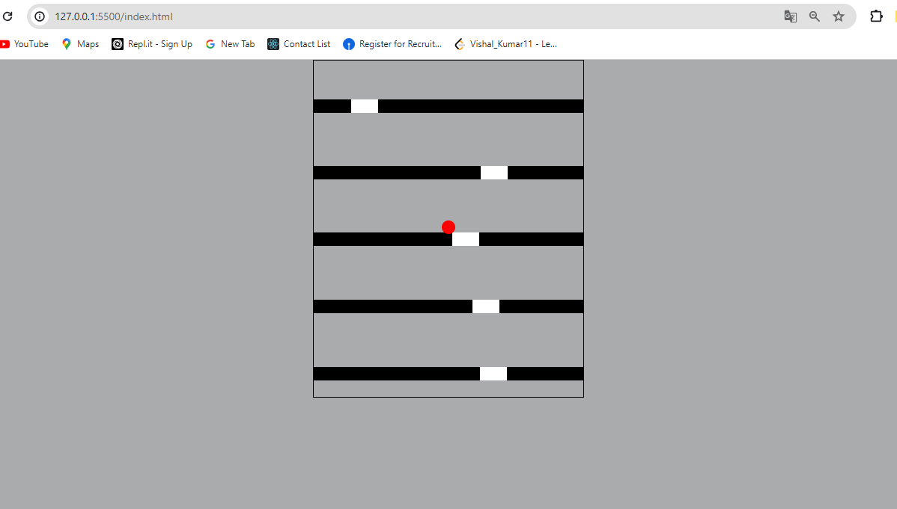
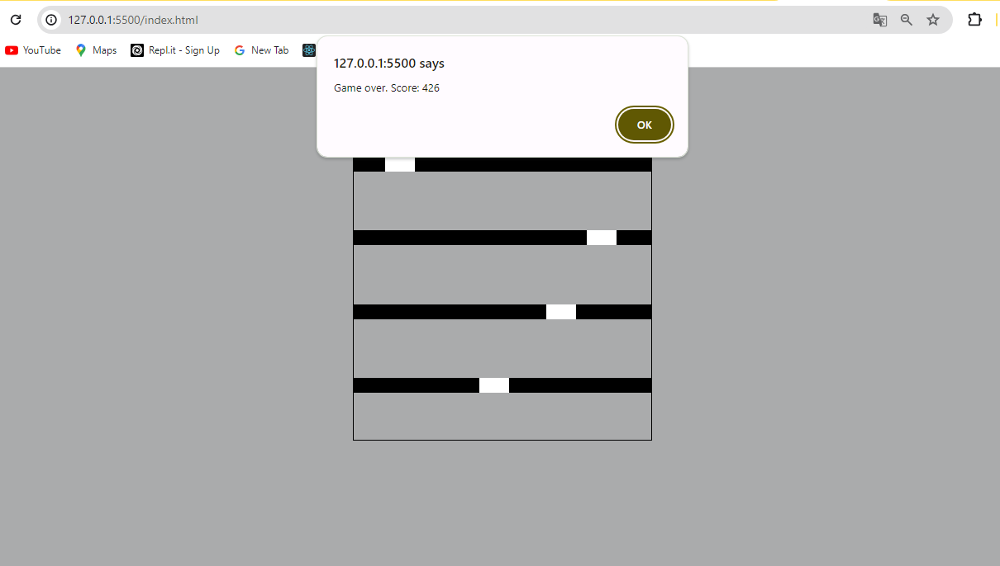

# Ball Game

This project is a simple ball game implemented using HTML, CSS, and JavaScript. The objective of the game is to move the ball left and right to avoid falling through holes in the blocks that continuously move upwards.

## Features

- Move the ball left and right using the arrow keys.
- Avoid falling through the holes in the blocks.
- The game ends if the ball falls off the screen.

## Getting Started

To get a local copy up and running follow these simple steps.

### Prerequisites

A web browser is required to run this project.

### Installation

1. Clone the repository

   ```sh
   git clone https://github.com/your_username/your_repository.git
   ```

2. Open the index.html file in your browser.

### Usage
- **Move Left:** Press the left arrow key to move the ball left.
- **Move Right:** Press the right arrow key to move the ball right.
- **Game Over:** If the ball falls off the screen, the game will alert "Game over" and display your score.

### Files
- **index.html:** The main HTML file that contains the structure of the game.
- **style.css:** The CSS file that styles the game.
- **script.js:** The JavaScript file that adds functionality to the game.

### How to Play
1. Open index.html in your browser.
2. Use the left and right arrow keys to control the ball.
3. Avoid falling through the holes in the blocks.
4. The game ends if the ball falls off the screen, and your score is displayed.

## Contributing
<p align="justify">Contributions are what make the open-source community such an amazing place to learn, inspire, and create. Any contributions you make are greatly appreciated.</p>

1. Fork the project.
2. Create your feature branch (git checkout -b feature/AmazingFeature).
3. Commit your changes (git commit -m 'Add some AmazingFeature').
4. Push to the branch (git push origin feature/AmazingFeature).
5. Open a pull request.

## License
Distributed under the MIT License. See LICENSE for more information.


## Output Screen
Here is how the game looks when it is running:

- Befor start the game
- 


- After finished the game
- 

